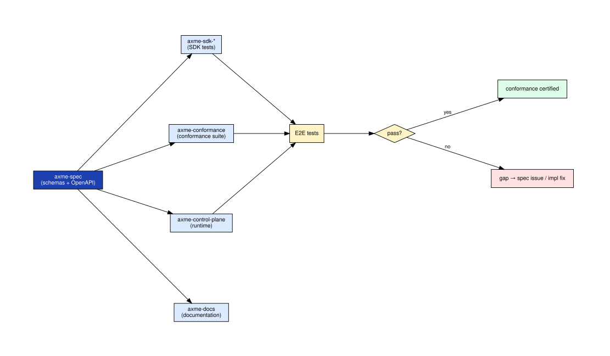
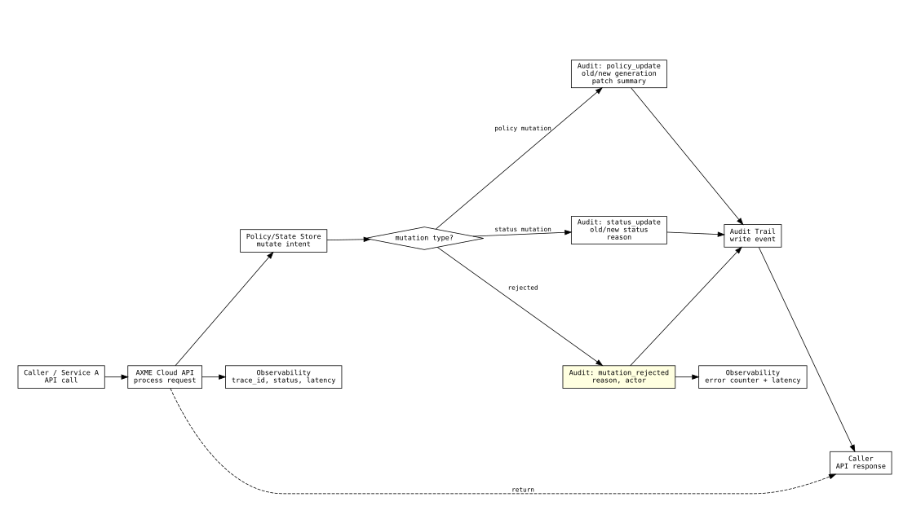
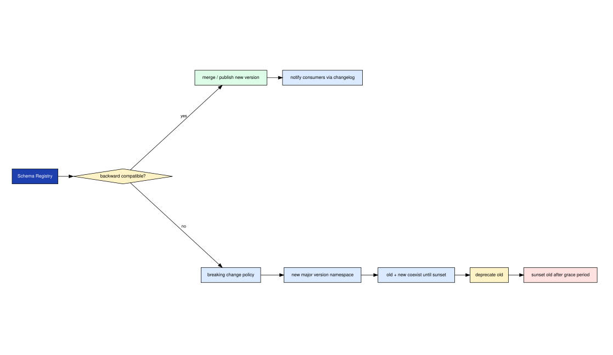
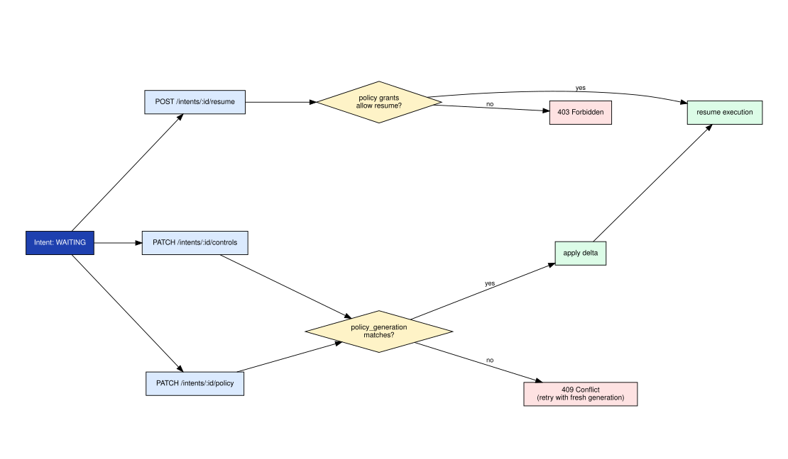

# axme-conformance

**Conformance suite for the AXME platform.** This repository contains the canonical contract test suite that validates spec-runtime-SDK parity across all API families, lifecycle invariants, and enterprise-boundary guarantees.

> **Alpha** · Conformance surface is expanding alongside the API. Not all families have full coverage yet.  
> Questions and conformance proposals → [hello@axme.ai](mailto:hello@axme.ai)

---

## What Is AXME?

AXME is a coordination infrastructure for durable execution of long-running intents across distributed systems.

It provides a model for executing **intents** — requests that may take minutes, hours, or longer to complete — across services, agents, and human participants.

## AXP — the Intent Protocol

At the core of AXME is **AXP (Intent Protocol)** — an open protocol that defines contracts and lifecycle rules for intent processing.

AXP can be implemented independently.  
The open part of the platform includes:

- the protocol specification and schemas
- SDKs and CLI for integration
- conformance tests
- implementation and integration documentation

## AXME Cloud

**AXME Cloud** is the managed service that runs AXP in production together with **The Registry** (identity and routing).

It removes operational complexity by providing:

- reliable intent delivery and retries  
- lifecycle management for long-running operations  
- handling of timeouts, waits, reminders, and escalation  
- observability of intent status and execution history  

State and events can be accessed through:

- API and SDKs  
- event streams and webhooks  
- the cloud console

---

## Purpose

The conformance suite is the authoritative answer to: *"Does this implementation correctly implement the AXME protocol and public API contracts?"*

It validates:

- **API contract correctness** — request/response shapes, status codes, error semantics
- **Lifecycle invariants** — state machine rules, terminal-state immutability, transition ordering
- **Idempotency guarantees** — duplicate requests return identical responses without side effects
- **Cursor and pagination** — consistent traversal across pages, stable ordering
- **Event consistency** — SSE and webhook event ordering and delivery guarantees
- **Enterprise access and tenant boundaries** — org/workspace scoping, role enforcement, quota limits
- **Control-delta semantics** — `resume`, `controls`, and `policy` mutation rules and conflict resolution

---

## Repository Structure

```
axme-conformance/
├── conformance/
│   ├── __init__.py
│   └── suite.py               # All contract checks and MCP contract suite
├── tests/
│   └── test_suite.py          # Pytest harness — runs suite against local transport
└── docs/
    └── diagrams/              # Conformance-specific diagrams
```

---

## Conformance Traceability

The traceability map shows how conformance checks are anchored to spec families, runtime behaviors, and SDK methods.



*Each check cell links a spec contract (from `axme-spec`) to a runtime behavior (tested against `axme-control-plane`) and an SDK binding (tested per SDK). Green = passing, yellow = partial, red = failing or not yet implemented.*

---

## Audit and Evidence

Conformance results feed the audit trail. Every check run produces an evidence record that maps to the access control and policy enforcement layer.



*Audit evidence is structured: which check ran, against which endpoint, with which actor identity, what the result was. Evidence records are stored in the CI artifact archive.*

---

## Schema Compatibility Checks

Schema governance checks validate that schema changes in `axme-spec` do not introduce backward-incompatible breaks for existing consumers.



*The compatibility check compares the new schema against all previously registered consumer versions. A breaking change fails the gate and requires a new schema version.*

---

## Resume, Controls, and Policy Conflict Resolution

The most complex conformance domain covers the three-way conflict between a `resume` call, an in-flight `controls` update, and a `policy` mutation arriving at the same instant.



*Conflict resolution rules: `resume` wins over `controls` if the intent is in a terminal `WAITING_*` state. `policy_generation` CAS prevents concurrent `policy` mutations from stomping each other. All conflicts are recorded in the audit trail.*

---

## Running the Suite

```bash
# Install
python -m pip install -e ".[dev]"

# Run all conformance checks
pytest

# Run a specific family
pytest conformance/checks/test_intents_lifecycle.py -v

# Run against a custom gateway
AXME_GATEWAY_URL=https://your-gateway.example.com pytest
```

---

## Coverage Matrix

Coverage by API family: all D1 families (intents, inbox, approvals, webhooks) have full contract checks. Enterprise admin families (orgs, workspaces, service accounts, quotas) are covered. The `billing` family has schema contracts defined but no conformance checks yet — tracked for addition. Target for Alpha release: all D1 families at 100% pass rate.

---

## Integration Rule

A conformance check is considered passing only when it succeeds against:

1. The reference runtime (`axme-control-plane` staging)
2. All five SDK clients (Python, TypeScript, Go, Java, .NET)
3. The schema definitions in `axme-spec`

---

## Related Repositories

| Repository | Relationship |
|---|---|
| [axme-spec](https://github.com/AxmeAI/axme-spec) | Source of truth for contracts being validated |
| Control-plane runtime (private) | Primary runtime under test |
| [axme-docs](https://github.com/AxmeAI/axme-docs) | Narrative documentation that conformance evidence supports |
| [axme-sdk-python](https://github.com/AxmeAI/axme-sdk-python) | Python SDK validated by this suite |
| [axme-sdk-typescript](https://github.com/AxmeAI/axme-sdk-typescript) | TypeScript SDK |
| [axme-sdk-go](https://github.com/AxmeAI/axme-sdk-go) | Go SDK |
| [axme-sdk-java](https://github.com/AxmeAI/axme-sdk-java) | Java SDK |
| [axme-sdk-dotnet](https://github.com/AxmeAI/axme-sdk-dotnet) | .NET SDK |

---

## Contributing & Contact

- New conformance check proposals: open an issue with label `conformance-proposal`
- Alpha access: https://cloud.axme.ai/alpha · Contact and suggestions: [hello@axme.ai](mailto:hello@axme.ai)
- Security disclosures: see [SECURITY.md](SECURITY.md)
- Contribution guidelines: [CONTRIBUTING.md](CONTRIBUTING.md)
